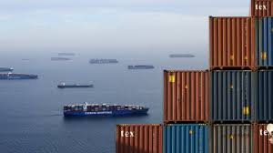

### 
**Time Series Analysis and Forecasting On Container Shipping Prices**

  

 <em>
  A time series is a series of data points indexed in time order. <strong>Time Series Analysis</strong> comprises <strong>methods</strong> for analyzing time series data to extract meaningful <strong>statistics and other characteristics</strong> of the data. <strong>Time Series Forecasting</strong> is the use of the model to <strong>predict</strong> future values based on previously observed values (make scientific predictions based on historical time stamped data). Here we are going to be doing a time series analysis on container shipping prices for three routes, North America East Coast to China/East Asia, Europe to North America East Coast, and Europe to South America West Coast using Data Collected from The Baltic Exchange, a membership organization for the maritime industry, and freight market information provider for the trading and settlement of physical and derivative contracts.
</em>

  

